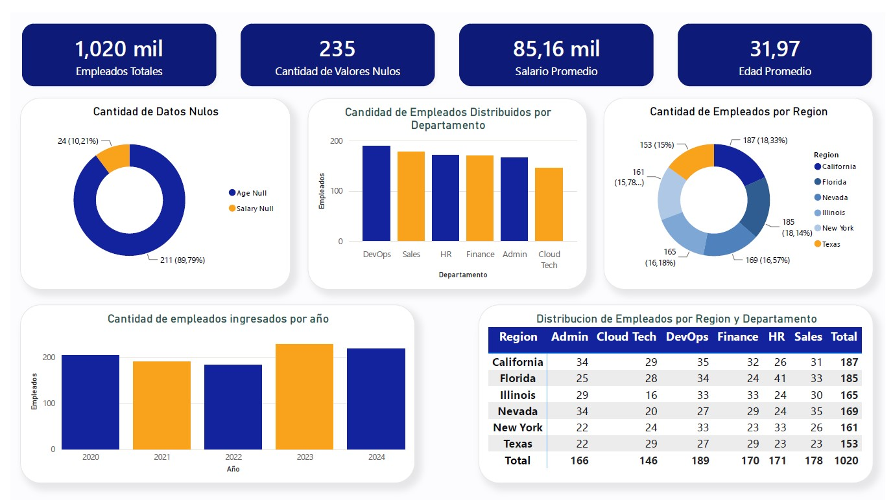

# Employee Data Quality Analysis

## Descripción del proyecto

Este proyecto tiene como objetivo analizar y mejorar la calidad de un dataset de empleados mediante un proceso completo de exploración, limpieza y transformación de datos.

El proyecto parte de un conjunto de datos con problemas reales de calidad, donde fue necesario identificar inconsistencias, analizar su impacto y aplicar diferentes estrategias para obtener información más confiable y estructurada.

El proceso realizado abarcó desde el análisis inicial del dataset hasta la generación de indicadores y visualizaciones que permiten interpretar el estado final de la información.

# Fuente de datos y selección del dataset

El dataset utilizado contiene información relacionada con empleados de una organización, incluyendo datos personales, laborales y salariales.

Fue seleccionado debido a que presentaba características similares a problemas encontrados en escenarios reales de análisis de datos:

- Valores faltantes.
- Inconsistencias en formatos.
- Tipos de datos incorrectos.
- Información combinada en una misma variable.
- Necesidad de normalización y limpieza previa al análisis.

La presencia de estos problemas permitió aplicar un flujo completo de Data Quality Analysis y evaluar cómo mejorar la confiabilidad de la información.

| Variable | Descripción |
|----------|-------------|
| Employee_ID | Identificador del empleado |
| First_Name | Nombre |
| Last_Name | Apellido |
| Age | Edad |
| Department_Region | Departamento y región |
| Status | Estado laboral |
| Join_Date | Fecha de ingreso |
| Salary | Salario |
| Email | Correo electrónico |
| Phone | Número telefónico |
| Performance_Score | Evaluación de desempeño |
| Remote_Work | Trabajo remoto |

# Proceso realizado

## Exploración inicial

En la primera etapa se realizó un análisis exploratorio para comprender la estructura del dataset y detectar posibles problemas.

Se evaluaron:

- Cantidad de registros y columnas.
- Tipos de datos.
- Distribución de variables.
- Estadísticas descriptivas.
- Valores faltantes.

Esta etapa permitió determinar qué transformaciones eran necesarias y definir una estrategia de limpieza adecuada.

## Identificación de problemas de calidad

Durante el análisis inicial se detectaron diferentes problemas dentro del dataset.

| Problema | Columna |
|----------|---------|
| Valores faltantes | Age |
| Valores faltantes | Salary |
| Tipo de dato incorrecto | Join_Date |
| Tipo de dato incorrecto | Phone |
| Columna compuesta | Department_Region |
| Formato inconsistente | Phone |

Entre ellos:

- Presencia de valores nulos en distintas variables.
- Datos con formatos inconsistentes.
- Columnas que contenían información combinada.
- Valores que requerían normalización para poder ser utilizados correctamente.

# Limpieza y transformación de datos

Para mejorar la calidad del dataset se aplicaron diferentes transformaciones:

## Tratamiento de valores faltantes

Se analizaron los valores ausentes y se aplicaron estrategias de imputación considerando las características de cada variable.

El objetivo fue mantener la mayor cantidad de información posible sin afectar la consistencia de los datos.

## Corrección de tipos de datos

Se revisaron y ajustaron los tipos de datos para representar correctamente cada variable.

Se realizaron modificaciones relacionadas con:

- Fechas.
- Variables numéricas.
- Campos que requerían formato texto.
- Normalización de valores inconsistentes.

## Reestructuración de variables

Se reorganizaron columnas que contenían información agrupada para obtener una estructura más clara y facilitar el análisis posterior. 

# Análisis de calidad de datos

Luego del proceso de limpieza se generaron métricas para evaluar el estado del dataset.

Se analizaron:

- Distribución de valores faltantes.
- Comportamiento de variables numéricas.
- Estado general de calidad de los datos.
- Diferencias entre el dataset inicial y el dataset procesado.

Las visualizaciones permitieron identificar problemas de forma más clara y comunicar los resultados obtenidos.

# Herramientas utilizadas

Las herramientas fueron seleccionadas según las necesidades del proyecto:

- Python: utilizado como lenguaje principal para desarrollar el flujo completo de análisis y transformación.
- Pandas: utilizado para manipulación, limpieza y transformación del dataset.
- NumPy: utilizado para operaciones numéricas y procesamiento de datos.
- Matplotlib y Seaborn: utilizados para generar visualizaciones que permitieron interpretar los resultados.
- Missingno: utilizado para analizar patrones y distribución de valores faltantes.

# Resultados obtenidos

Luego del proceso de limpieza se obtuvo un dataset con una estructura más consistente y preparado para continuar con etapas posteriores de análisis.

| Aspecto | Antes | Después |
|---------|--------|----------|
| Registros | 1020 | 1020 |
| Valores faltantes | Age y Salary | Sin valores faltantes |
| Join_Date | String | Datetime |
| Phone | Entero | String |
| Department_Region | Columna compuesta | Department + Region |
| Integridad del dataset | Inconsistente | Validado |

Principales resultados:

- Identificación de problemas de calidad presentes en los datos originales.
- Corrección de inconsistencias detectadas.
- Tratamiento de valores faltantes.
- Mejora en la organización de la información.
- Generación de indicadores para evaluar la calidad del dataset.

El proceso permitió transformar datos con problemas de calidad en información más confiable y preparada para su análisis.

# Dashboard de análisis

Como etapa final del proyecto se desarrolló un dashboard con el objetivo de comparar y visualizar el impacto del proceso de limpieza y transformación aplicado sobre el dataset.

Inicialmente, se analizaron indicadores de calidad para identificar el estado de los datos antes del proceso de limpieza, permitiendo observar la presencia de valores faltantes e inconsistencias que podían afectar la interpretación de la información.

Luego de aplicar las transformaciones necesarias, se generaron nuevas visualizaciones utilizando el dataset procesado, permitiendo realizar un análisis más claro de la información y obtener una representación más precisa de las características de los empleados.

La transformación de los datos permitió pasar de un dataset con problemas de calidad a una fuente de información más organizada y confiable, facilitando la identificación de patrones, la interpretación de resultados y la generación de futuros análisis.

El dashboard representa la última etapa del proyecto, donde los procesos de limpieza y validación realizados se convierten en información visual que puede ser utilizada para una mejor comprensión y toma de decisiones.

# Conclusión

Este proyecto permitió aplicar un flujo completo de trabajo orientado a la calidad de datos, comenzando desde un dataset con problemas de consistencia hasta obtener una estructura más ordenada y preparada para análisis posteriores.

A través del proceso de exploración, identificación de problemas, limpieza y transformación, se logró mejorar la calidad de la información y comprender la importancia que tiene la preparación de los datos antes de realizar cualquier análisis.

Además, la creación del dashboard permitió visualizar de forma más clara los resultados obtenidos, demostrando cómo un correcto tratamiento de los datos facilita la interpretación de la información y permite generar análisis más confiables.

Este proyecto representa una aplicación práctica de técnicas utilizadas en escenarios reales de Data Analytics, donde la calidad de los datos es una etapa fundamental para obtener resultados precisos y útiles.