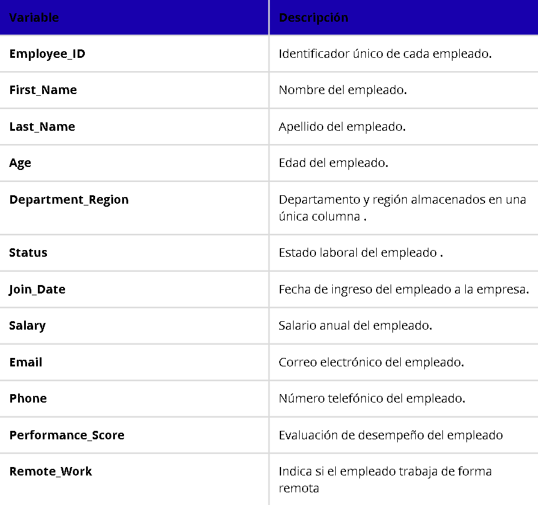

Employee Data Quality Assessment

Evaluación, limpieza y validación del Messy Employee Dataset utilizando Python, Pandas y Power BI.

Tabla Direccion

image.png

Este proyecto tiene como objetivo evaluar y mejorar la calidad del Messy Employee Dataset, un conjunto de datos que contiene problemas habituales de calidad, como valores faltantes, tipos de datos incorrectos, formatos inconsistentes y columnas que almacenan más de un atributo.

A lo largo del proyecto se desarrolló un proceso completo de evaluación, limpieza y validación de los datos, documentando cada decisión tomada y justificando las transformaciones aplicadas.

El resultado fue un dataset consistente y preparado para ser utilizado en análisis posteriores y en la construcción de un dashboard en Power BI.

¿Por qué elegí este dataset?

Elegí este conjunto de datos porque permite trabajar con problemas frecuentes en proyectos reales de preparación de datos. A diferencia de otros datasets que ya se encuentran relativamente limpios, este presenta distintos tipos de inconsistencias que requieren aplicar criterios de análisis antes de realizar cualquier transformación.

Objetivos

-Evaluar el estado inicial del dataset.
-Identificar problemas de calidad en las distintas variables.
-Aplicar técnicas de limpieza adecuadas para cada caso.
-Validar las transformaciones realizadas.
-Construir un dashboard que resuma visualmente el proceso de limpieza.

